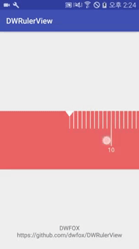

DWRulerView
=========

[](http://www.youtube.com/watch?v=Udy_ThDo5kw)


### Usage
```java
        myScrollingValuePicker = (ScrollingValuePicker) findViewById(R.id.myScrollingValuePicker);
        myScrollingValuePicker.setViewMultipleSize(LINE_RULER_MULTIPLE_SIZE);
        myScrollingValuePicker.setMaxValue(MIN_VALUE, MAX_VALUE);
        myScrollingValuePicker.setValueTypeMultiple(5);
        myScrollingValuePicker.getScrollView().setOnTouchListener(new View.OnTouchListener() {
            @Override
            public boolean onTouch(View v, MotionEvent event) {
                if (event.getAction() == MotionEvent.ACTION_UP) {
                    myScrollingValuePicker.getScrollView().startScrollerTask();
                }
                return false;
            }
        });
```

### Get Value
```java
        myScrollingValuePicker.setOnScrollChangedListener(new ObservableHorizontalScrollView.OnScrollChangedListener() {

                    @Override
                    public void onScrollChanged(ObservableHorizontalScrollView view, int l, int t) {
                    }

                    @Override
                    public void onScrollStopped(int l, int t) {
                        text.setText("Value STOP : " + DWUtils.getValueAndScrollItemToCenter(myScrollingValuePicker.getScrollView() // set TextView
                                        , l
                                        , t
                                        , MAX_VALUE
                                        , MIN_VALUE
                                        , myScrollingValuePicker.getViewMultipleSize()));
                    }
                });
```

### Gradle

```groovy
allprojects {
		repositories {
			...
			maven { url "https://jitpack.io" }
		}
}
```

```groovy
dependencies {
	  compile 'com.github.dwfox:DWRulerView:1.0.0'
}
```
